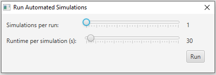

# ACO-Dynamic
JavaFX based GUI for Implementation of Ant Colony Optimisation as a simulation for point-to-point shortest path problem.

  

Uses Ant System and Max-Min Ant System algorithms (in a basic/crude form). Allows for nodes to be generated using Java's Random class and uses a proximity based system for connecting nodes with edges.

## Features
### Run simulations on an environment  

  

### Store simulation best route logs  

  

### Configure the number of ants, number of nodes, and pheromone multiplier  

  

### Dynamically update the environment
- Add nodes+edges
- Remove nodes+edges
- Add traffic to edges
- Remove traffic to edges

## maven build & run
- Download maven and add to PATH.  
- `mvn clean`  
- `mvn compile `  
- `mvn package`  
- `java -cp target\ACO-Dynamic-1.0-SNAPSHOT.jar com.readyplayer2.aco.dynamic.ACODynamic`

## notes
`ACODynamic.java` currently does the heavy lifting and can be vastly improved and modularised (really this is true for the whole project). 
